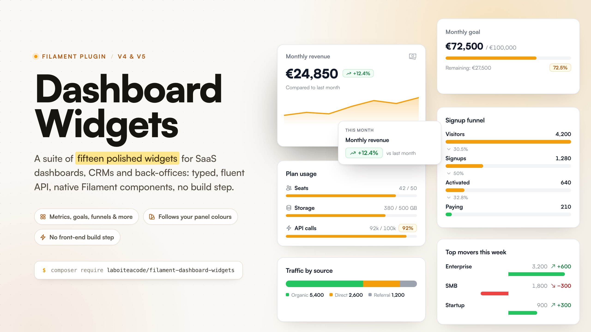

# Filament Dashboard Widgets

[](https://packagist.org/packages/laboiteacode/filament-dashboard-widgets)
[](https://github.com/la-boite-a-code/filament-dashboard-widgets/actions/workflows/run-tests.yml)
[](https://packagist.org/packages/laboiteacode/filament-dashboard-widgets)
[](LICENSE.md)



A collection of ready to use, professional dashboard widgets for Filament,
oriented towards SaaS products, CRMs, back-offices and business tools.

Filament ships the primitives; developers keep rebuilding the same KPI cards,
goals, progressions, breakdowns and short lists on top of them. This package
provides fifteen distinct, polished widgets with a consistent, typed API, a
professional look and a quick install with no additional front-end
dependencies.

## Features

- **Fifteen distinct widgets**: metric, goal progress, breakdown, trend, recent
  items, composition, detail list, bullet, funnel, timeline, variance, segment
  bar, usage limits, comparison chart and a flexible, customizable card.
- **Consistent, typed API** built on fluent, immutable friendly data objects.
- **Static or computed data**, with closures evaluated at render time.
- **Native Filament everywhere it counts**: empty states, badges, icons, links
  and actions all use Filament's own components, so they follow your panel.
- **Light and dark themes** and full responsiveness out of the box.
- **No front-end build step**: a small, self contained stylesheet is injected
  inline, using Filament design tokens and the panel accent colour.
- **Accessible**: structured headings, screen reader labels, WCAG AA contrast
  in both themes, keyboard focus styles and `prefers-reduced-motion` support.
- Escaped by default, with no query ever run by the package.

## Requirements

- PHP 8.3, 8.4 or 8.5
- Laravel 12 or 13
- Filament 4.12+ or 5.7.1+

## Installation

```bash
composer require laboiteacode/filament-dashboard-widgets
```

The package works out of the box. Publishing its resources is optional:

```bash
php artisan vendor:publish --tag="filament-dashboard-widgets-config"
php artisan vendor:publish --tag="filament-dashboard-widgets-translations"
```

## Registering the plugin

Register the plugin on your panel:

```php
use LaBoiteACode\FilamentDashboardWidgets\FilamentDashboardWidgetsPlugin;

public function panel(Panel $panel): Panel
{
    return $panel
        ->plugins([
            FilamentDashboardWidgetsPlugin::make(),
        ]);
}
```

Each widget shipped by the package is an abstract class. Your application
extends it and provides the data. You then register your concrete widgets like
any other Filament widget:

```php
protected function getHeaderWidgets(): array
{
    return [
        MonthlyRevenueWidget::class,
        ConversionGoalWidget::class,
        CustomerBreakdownWidget::class,
    ];
}
```

## Building a widget

### MetricWidget

Displays a primary indicator with context and a trend.

```php
use Illuminate\Support\Number;
use LaBoiteACode\FilamentDashboardWidgets\Data\Metric;
use LaBoiteACode\FilamentDashboardWidgets\Widgets\MetricWidget;

class MonthlyRevenueWidget extends MetricWidget
{
    protected function getMetric(): Metric
    {
        return Metric::make('Monthly revenue', 24_850)
            ->formatUsing(fn (int $value) => Number::currency($value, 'EUR'))
            ->description('Compared to last month')
            ->trend(12.4)
            ->icon('heroicon-o-banknotes')
            ->color('success')
            ->sparkline([12, 14, 13, 18, 20, 19, 24])
            ->url(route('filament.admin.resources.orders.index'));
    }
}
```

Trend semantics:

- A trend above zero is positive, below zero is negative, zero or absent is
  neutral.
- Call `->lowerIsBetter()` to invert the semantics, for example when a drop in
  the error rate is a good thing.
- Non numeric values are supported when no trend is computed.

### GoalProgressWidget

Displays the progress towards a goal.

```php
use Illuminate\Support\Number;
use LaBoiteACode\FilamentDashboardWidgets\Data\Goal;
use LaBoiteACode\FilamentDashboardWidgets\Widgets\GoalProgressWidget;

class ConversionGoalWidget extends GoalProgressWidget
{
    protected function getGoal(): Goal
    {
        return Goal::make('Monthly goal', current: 72_500, target: 100_000)
            ->formatUsing(fn ($value) => Number::currency($value, 'EUR'))
            ->deadline(now()->endOfMonth())
            ->color('primary')
            ->showRemaining()
            ->showPercentage();
    }
}
```

The percentage is capped at 100 by default and the overflow is shown in the
text. Call `->allowOverflow()` to display the real percentage beyond 100. Zero
targets and negative values are handled explicitly.

### RecentItemsWidget

Displays a short list of recent items without needing a full table widget.

```php
use Illuminate\Support\Number;
use LaBoiteACode\FilamentDashboardWidgets\Data\RecentItem;
use LaBoiteACode\FilamentDashboardWidgets\Widgets\RecentItemsWidget;

class RecentOrdersWidget extends RecentItemsWidget
{
    protected ?string $heading = 'Recent orders';

    protected function getViewAllUrl(): ?string
    {
        return OrderResource::getUrl('index');
    }

    protected function getItems(): array
    {
        return Order::query()
            ->latest()
            ->limit(5)
            ->get()
            ->map(fn (Order $order) => RecentItem::make(
                title: "#{$order->number}",
                description: $order->customer->name,
            )
                ->meta(Number::currency($order->total, 'EUR'))
                ->badge($order->status->getLabel())
                ->badgeColor($order->status->getColor())
                ->url(OrderResource::getUrl('view', ['record' => $order])))
            ->all();
    }
}
```

The "View all" footer is a real Filament action. Return a URL from
`getViewAllUrl()` to reveal it, or override `viewAllAction()` for full control.

### BreakdownWidget

Displays a simple breakdown without forcing a complex chart.

```php
use LaBoiteACode\FilamentDashboardWidgets\Data\BreakdownItem;
use LaBoiteACode\FilamentDashboardWidgets\Widgets\BreakdownWidget;

class CustomerBreakdownWidget extends BreakdownWidget
{
    protected ?string $heading = 'Customers by status';

    protected function getItems(): array
    {
        return [
            BreakdownItem::make('Active', 148)
                ->color('success')
                ->icon('heroicon-o-check-circle'),

            BreakdownItem::make('Pending', 32)
                ->color('warning'),

            BreakdownItem::make('Inactive', 12)
                ->color('gray'),
        ];
    }
}
```

Percentages are computed from the total of the items. Provide an explicit total
with `getTotal()`, sort by descending value with `shouldSortByValue()`, and cap
the number of visible items with the `breakdown.limit` config.

### TrendWidget

Displays a time series with a summary, built on Filament's native chart widget.

```php
use LaBoiteACode\FilamentDashboardWidgets\Data\Trend;
use LaBoiteACode\FilamentDashboardWidgets\Data\TrendPoint;
use LaBoiteACode\FilamentDashboardWidgets\Widgets\TrendWidget;

class NewCustomersTrendWidget extends TrendWidget
{
    protected function getTrend(): Trend
    {
        return Trend::make('New customers')
            ->value(184)
            ->comparison(16.8)
            ->points([
                TrendPoint::make('2026-07-01', 18),
                TrendPoint::make('2026-07-02', 24),
                TrendPoint::make('2026-07-03', 21),
            ])
            ->type('area')
            ->color('primary');
    }
}
```

The supported types are `line`, `bar` and `area`. The data is prepared in PHP
and drawn by Filament's Chart.js integration; no JavaScript ships with this
package.

### CompositionWidget

Displays a part to whole breakdown as a radial chart, built on Filament's
native chart widget.

```php
use Illuminate\Support\Number;
use LaBoiteACode\FilamentDashboardWidgets\Data\Composition;
use LaBoiteACode\FilamentDashboardWidgets\Data\CompositionSlice;
use LaBoiteACode\FilamentDashboardWidgets\Widgets\CompositionWidget;

class RevenueCompositionWidget extends CompositionWidget
{
    protected function getComposition(): Composition
    {
        return Composition::make('Revenue by channel')
            ->type('doughnut')
            ->formatUsing(fn (float $value) => Number::currency($value, 'EUR'))
            ->slices([
                CompositionSlice::make('Direct', 12_000)->color('primary'),
                CompositionSlice::make('Marketplace', 8_000)->color('success'),
                CompositionSlice::make('Partners', 5_000)->color('warning'),
            ]);
    }
}
```

The supported types are `doughnut`, `pie` and `polarArea`. Slice colours resolve
to your panel's registered Filament colours (unassigned slices cycle the default
palette), and the total is surfaced in the summary.

### DetailListWidget

Displays a sober key to value panel, ideal for record summaries in CRMs and
back-offices.

```php
use Illuminate\Support\Number;
use LaBoiteACode\FilamentDashboardWidgets\Data\Detail;
use LaBoiteACode\FilamentDashboardWidgets\Widgets\DetailListWidget;

class CustomerDetailWidget extends DetailListWidget
{
    protected ?string $heading = 'Customer';

    protected function getDetails(): array
    {
        return [
            Detail::make('Status', 'Active')->badge('Active')->badgeColor('success'),
            Detail::make('Plan', 'Pro')->icon('heroicon-o-star'),
            Detail::make('MRR', 4_900)->formatUsing(fn (int $value) => Number::currency($value, 'EUR')),
            Detail::make('Website', 'example.test')->url('https://example.test'),
            Detail::make('Notes', null),
        ];
    }
}
```

Rows render as a semantic description list. Empty values fall back to a
placeholder, and a value can carry a badge, an icon or a link.

### BulletWidget

Displays a value against a target with qualitative context bands and an optional
benchmark marker (a bullet graph).

```php
use LaBoiteACode\FilamentDashboardWidgets\Data\Bullet;
use LaBoiteACode\FilamentDashboardWidgets\Widgets\BulletWidget;

class SatisfactionBulletWidget extends BulletWidget
{
    protected function getBullet(): Bullet
    {
        return Bullet::make('Customer satisfaction', 82)
            ->target(90)
            ->max(100)
            ->comparative(75)
            ->ranges([50, 75])
            ->formatUsing(fn (float $value) => "{$value}%");
    }
}
```

The `ranges()` thresholds draw neutral poor / fair / good context bands, a tick
marks the target and a dot marks the benchmark. The status is always textual, so
the reading is never carried by colour alone. Use `->lowerIsBetter()` when a
smaller value is the goal.

### FunnelWidget

Displays an ordered conversion funnel with the drop-off between steps.

```php
use LaBoiteACode\FilamentDashboardWidgets\Data\FunnelStage;
use LaBoiteACode\FilamentDashboardWidgets\Widgets\FunnelWidget;

class SignupFunnelWidget extends FunnelWidget
{
    protected ?string $heading = 'Signup funnel';

    protected function getStages(): array
    {
        return [
            FunnelStage::make('Visitors', 4_200),
            FunnelStage::make('Signups', 1_280),
            FunnelStage::make('Activated', 640),
            FunnelStage::make('Paying', 210)->color('success'),
        ];
    }
}
```

Each bar tapers relative to the first stage, the connectors show the step
conversion, and the overall conversion is summarised at the bottom.

### TimelineWidget

Displays a vertical activity or audit feed with relative times.

```php
use LaBoiteACode\FilamentDashboardWidgets\Data\TimelineEvent;
use LaBoiteACode\FilamentDashboardWidgets\Widgets\TimelineWidget;

class ActivityTimelineWidget extends TimelineWidget
{
    protected ?string $heading = 'Recent activity';

    protected function shouldGroupByDay(): bool
    {
        return true;
    }

    protected function getViewAllUrl(): ?string
    {
        return ActivityResource::getUrl('index');
    }

    protected function getEvents(): array
    {
        return Activity::query()
            ->latest()
            ->limit(8)
            ->get()
            ->map(fn (Activity $activity) => TimelineEvent::make($activity->description)
                ->timestamp($activity->created_at)
                ->icon('heroicon-o-bolt')
                ->color('primary')
                ->actor($activity->causer?->name))
            ->all();
    }
}
```

Times are shown relatively (locale aware), events can be grouped by day, and the
footer "View all" is a native Filament action.

### VarianceWidget

Displays categories ranked by their change, as diverging bars around a zero
axis.

```php
use LaBoiteACode\FilamentDashboardWidgets\Data\VarianceItem;
use LaBoiteACode\FilamentDashboardWidgets\Widgets\VarianceWidget;

class TopMoversWidget extends VarianceWidget
{
    protected ?string $heading = 'Top movers this week';

    protected function shouldSortByChange(): bool
    {
        return true;
    }

    protected function getItems(): array
    {
        return [
            VarianceItem::make('Enterprise', 3_200)->previous(2_600),
            VarianceItem::make('SMB', 1_800)->previous(2_100),
            VarianceItem::make('Startup', 900)->previous(600),
        ];
    }
}
```

The bar grows right for gains and left for losses. The sign is carried by the
side, the signed text and an icon, never by colour alone. Provide an explicit
`->change()`, or a `->previous()` value to derive it, and use `->lowerIsBetter()`
per item.

### SegmentBarWidget

Displays a whole split into proportional segments on a single stacked track,
reusing the `BreakdownItem` object.

```php
use LaBoiteACode\FilamentDashboardWidgets\Data\BreakdownItem;
use LaBoiteACode\FilamentDashboardWidgets\Widgets\SegmentBarWidget;

class TrafficSegmentWidget extends SegmentBarWidget
{
    protected ?string $heading = 'Traffic by source';

    protected function getSegments(): array
    {
        return [
            BreakdownItem::make('Organic', 5_400)->color('success'),
            BreakdownItem::make('Direct', 2_600)->color('primary'),
            BreakdownItem::make('Referral', 1_200)->color('warning'),
        ];
    }
}
```

The legend below carries the label, value and share, so meaning is never
conveyed by colour alone. Provide `getTotal()` to render unfilled headroom.

### UsageLimitsWidget

Tracks consumption against quotas, one meter per resource, with an optional
warning threshold.

```php
use LaBoiteACode\FilamentDashboardWidgets\Data\UsageLimit;
use LaBoiteACode\FilamentDashboardWidgets\Widgets\UsageLimitsWidget;

class ResourceUsageWidget extends UsageLimitsWidget
{
    protected ?string $heading = 'Plan usage';

    protected function getLimits(): array
    {
        return [
            UsageLimit::make('Seats', 42, 50)->warnThreshold(0.8)->icon('heroicon-o-users'),
            UsageLimit::make('Storage', 380, 500)
                ->warnThreshold(0.9)
                ->formatUsing(fn (float $value): string => number_format($value).' GB'),
            UsageLimit::make('API calls', 92_000, 100_000)->warnThreshold(0.8),
        ];
    }
}
```

Each row is a `role="meter"` progress track. It turns to the `warning` colour
once `->warnThreshold()` (a fraction of the limit) is crossed, and to `danger`
when over the limit. Format the value and limit with `->formatUsing()`.

### ComparisonChartWidget

Plots several series against a shared set of labels, for example actual versus
target versus forecast, which a single trend line cannot show.

```php
use LaBoiteACode\FilamentDashboardWidgets\Data\ChartSeries;
use LaBoiteACode\FilamentDashboardWidgets\Widgets\ComparisonChartWidget;

class RevenueVsTargetWidget extends ComparisonChartWidget
{
    protected ?string $heading = 'Revenue vs target';

    protected function getLabels(): array
    {
        return ['Jan', 'Feb', 'Mar', 'Apr'];
    }

    protected function getSeries(): array
    {
        return [
            ChartSeries::make('Actual')->values([12, 18, 15, 22])->color('primary')->filled(),
            ChartSeries::make('Target')->values([14, 16, 18, 20])->color('gray'),
        ];
    }
}
```

Each series renders as a `line` or `bar` (`->type()`) and takes a Filament
colour token via `->color()`; series without one cycle the default palette. A
`->filled()` line series shades the area under the line with a translucent tint
of its colour, in light and dark themes alike. Built on Filament's own
`ChartWidget`.

### CardWidget

A flexible, customizable card for the pieces a dashboard always needs but that
do not warrant a dedicated widget: a highlight, a shortcut, an announcement or a
call to action. One widget, four layout variants. Register as many as you like
and size each one with Filament's `columnSpan`.

```php
use LaBoiteACode\FilamentDashboardWidgets\Data\Card;
use LaBoiteACode\FilamentDashboardWidgets\Data\WidgetAction;
use LaBoiteACode\FilamentDashboardWidgets\Widgets\CardWidget;

class ActiveUsersCardWidget extends CardWidget
{
    protected function getCard(): Card
    {
        return Card::make('Active users')
            ->variant('stat')
            ->value(2_318)
            ->formatUsing(fn (int $value): string => number_format($value))
            ->description('Compared to last week')
            ->badge('+8.1%')
            ->badgeColor('success')
            ->icon('heroicon-o-users')
            ->color('primary');
    }
}
```

The four variants share the same fluent object:

- `stat`: a label, a large `->value()` (with `->formatUsing()`), an optional
  `->badge()` and a corner `->icon()`. A lighter KPI card than `MetricWidget`.
- `icon`: a prominent `->icon()` tile next to a title and `->description()`.
  Ideal for navigation and shortcuts. Set `->url()` to make the whole card a
  link.
- `content`: a title, an optional `->badge()`, free `->description()` text and
  footer links from `->actions()`. The generic catch all card.
- `cta`: a centred call to action with an `->icon()`, text and native Filament
  action buttons built from `->actions()`.

```php
Card::make('Invite your team')
    ->variant('cta')
    ->icon('heroicon-o-user-plus')
    ->description('Collaborate by adding your colleagues to the workspace.')
    ->actions([
        WidgetAction::make('Send invites')->url('/team/invite')->icon('heroicon-m-paper-airplane'),
        WidgetAction::make('Learn more')->url('/docs/team'),
    ]);
```

Any `stat`, `icon` or `content` card becomes clickable with `->url()`, and every
colour, badge, icon and button uses Filament's own components and tokens.

## Customization

Common options are shared across the widgets:

```php
// On the data objects
->color('primary')
->icon('heroicon-o-chart-bar')
->url('/admin/orders')
->openUrlInNewTab()

// On the widgets (override the methods or set the properties)
protected ?string $heading = 'Recent orders';

protected function getEmptyStateHeading(): ?string
{
    return 'No orders yet';
}
```

Widths use Filament's native `columnSpan`:

```php
protected int | string | array $columnSpan = 2;
```

## Themes

The widgets follow Filament automatically:

- Colours resolve to your panel's registered Filament colours, so nothing is
  hard coded and the accent colour is respected.
- Light and dark themes are fully supported.
- Interactive cards use a subtle hover effect that honours
  `prefers-reduced-motion`.

## Polling

Polling is disabled by default. Set a global default in the config, or override
it per widget:

```php
// config/filament-dashboard-widgets.php
'polling_interval' => '30s',
```

```php
class LiveVisitorsWidget extends MetricWidget
{
    protected ?string $pollingInterval = '10s';
}
```

## Cache

The package does not cache anything for you, but caching your data is easy:

```php
protected function getMetric(): Metric
{
    return Cache::remember('dashboard.monthly-revenue', now()->addMinutes(5), fn () =>
        Metric::make('Monthly revenue', $this->computeRevenue()));
}
```

## Translations

English and French translations are shipped. Publish them to customize:

```bash
php artisan vendor:publish --tag="filament-dashboard-widgets-translations"
```

The titles and business data always come from your application; only the shared
labels ("View all", "Remaining", "Goal reached", and so on) are translated.

## Going further

- [Architecture and design decisions](docs/architecture.md)
- [A complete demo dashboard](docs/demo.md)
- [Upgrade guide](UPGRADING.md)
- [Changelog](CHANGELOG.md)

## Testing

```bash
composer test
```

## Contributing

Please see [CONTRIBUTING.md](CONTRIBUTING.md) for details.

## Security

Please see [SECURITY.md](SECURITY.md) for how to report vulnerabilities.

## Credits

- [Alexandre Ribes](https://alexandre-ribes.fr)
- [La Boite A Code](https://laboiteacode.fr)

## License

The MIT License (MIT). Please see [License File](LICENSE.md) for more
information.
